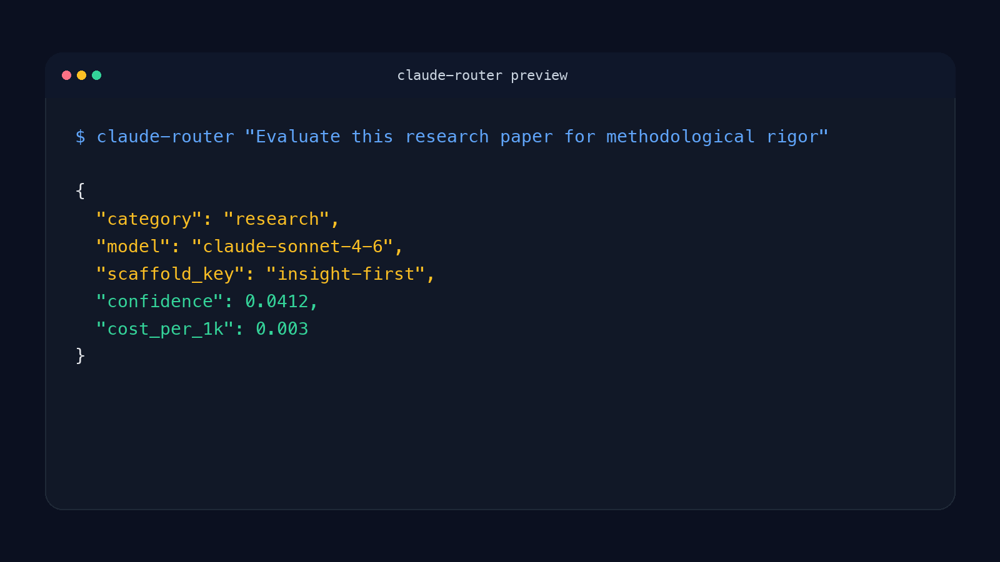

# claude-router

Claude teams overspend on Sonnet or Opus because nobody has a fast, repeatable way to decide when Haiku plus structure is enough.

`claude-router` classifies a prompt locally, chooses the right Claude tier, and prepends the right scaffold when scaffolding actually improves quality.

- "We default to Sonnet for everything because nobody trusts routing by hand."
- "Some prompts need structure, but we keep discovering that too late."
- "We know Haiku is cheaper, but we do not know when it is safe."
- "Prompt reviews catch model-choice mistakes after the API bill already happened."

```bash
pip install claude-router
```

```python
from claude_router import ClaudeRouter

router = ClaudeRouter()
result = router.route("Evaluate this research paper for methodological rigor")
print(result["model"], result["scaffold_key"], result["cost_per_1k"])
```

```text
claude-haiku-4-5 calibrated-scoring 0.0008
```

**When To Use It**

Use `claude-router` when you already call Claude models and want a local, deterministic routing layer for eval, research, content, and review prompts.

**When Not To Use It**

Do not use `claude-router` as a general agent framework, as proof that these exact routes transfer to your workload, or if you do not want an Ollama-based local classifier in the loop.



## Results

| Task | Best Setup | Cost | Quality vs. Baseline |
|------|-----------|------|------------|
| Eval/scoring | Haiku + scaffold | $0.06 | MAE 1.0 (vs Sonnet raw: 1.2) |
| Research | Sonnet + scaffold | $0.28 | 8.49/10 (vs Opus raw: 7.45) |
| Content | Haiku + scaffold | $0.06 | 4/5 blind wins vs Sonnet |
| Code review | Sonnet (raw) | $0.28 | 8.7/10 (vs Opus: 8.1) |

## Anti-findings

These are the blocker issues. The router handles them automatically:

- **Scaffolds break operational tasks** (0/9 success). Haiku treats constraints as meta-instructions instead of executing tasks.
- **Scaffolds hurt coding** (4.9 vs 6.4 raw). Don't scaffold code review, design, or debugging.
- **Opus doesn't scaffold**. Safety-critical evals need Opus raw (MAE 0.0), not scaffolded.

The routing table avoids these entirely: no scaffolds on operational, coding, safety-critical, or conversation tasks.

## Install

Requires: Python 3.10+, `requests`, `numpy`, and [Ollama](https://ollama.com) running locally with nomic-embed-text.

```bash
pip install claude-router
ollama pull nomic-embed-text
```

## Quick start

```python
from claude_router import ClaudeRouter

router = ClaudeRouter()
result = router.route("Evaluate this research paper for methodological rigor")

print(result["model"])           # claude-haiku-4-5
print(result["scaffold_key"])    # calibrated-scoring
print(result["cost_per_1k"])     # 0.0008

# Build prompt with scaffold prepended
prompt = router.build_prompt("Evaluate this research paper...")
# → Pass prompt as system message to Anthropic API
```

Or CLI:

```bash
python router.py "Write a blog post about Q2 results"
```

## How it works

1. Embed your prompt using nomic-embed-text (~5ms)
2. Compare against pre-computed task-category centroids
3. Look up routing table: category → model + scaffold
4. Return model ID and scaffold text

No LLM calls for routing. All locally in ~10ms. Low confidence (router accuracy 74% on 26-prompt benchmark) defaults to Opus.

## The 5 scaffolds

Each scaffold is validated through blind evaluation. They work by constraining the model's output space to the task structure.

See [scaffolds.json](scaffolds.json) for full text and evidence:

- **calibrated-scoring**: Integer 1-10, cite evidence, not generous/critical
- **insight-first**: Lead non-obvious, concrete recs, 3-4 sentences
- **plan-first**: g:goal;c:constraints;s:steps;r:risks prefix
- **substance-check**: Real gaps not surface, name issue and location
- **bug-hunt**: Specific bugs, line numbers, severity, one-line fix

## Routing table

```
eval              → Haiku   + calibrated-scoring
research          → Sonnet  + insight-first
content           → Haiku   + insight-first
analytical_review → Haiku   + substance-check
search            → Haiku   + plan-first

coding            → Sonnet  (raw)
operational       → Sonnet  (raw)
status_check      → Haiku   (raw)
conversation      → Opus    (raw)
safety_critical   → Opus    (raw)
```

Low confidence → Opus (safe default).

## Cost math

For 10,000 Claude API calls/month:

| Strategy | Cost | Quality |
|----------|------|---------|
| All Opus | $6,800 | Baseline |
| All Sonnet | $2,800 | Lower on eval, equal on code |
| claude-router | ~$620 | Equal or better on eval/research/content |

## Customization

Swap scaffolds, centroids, or routing table:

```python
router = ClaudeRouter(
    centroids_path="my_centroids.json",
    routing_table_path="my_routing.json",
    scaffolds_path="my_scaffolds.json"
)
```

## Limitations

- Requires Ollama locally (for embeddings)
- Centroids trained on one task distribution — test on your workload
- Router misclassifies 26% of tasks — low confidence defaults to Opus
- Anti-findings are real: scaffolds on coding/operational make things worse
- Lite mode (Haiku-first routing for max savings) planned for v1.1

## Evidence

Benchmarks: [benchmarks/](benchmarks/) | Raw citations: [scaffolds.json](scaffolds.json) | License: [MIT](LICENSE)

Key experiments: 4-condition code/research crossover, scaffolds-vs-operational stress test, scaffolded Sonnet beats Opus 75% on research (6/8 blind wins, 140 API calls).

Need this calibrated to your pipeline? [Open an issue](https://github.com/hermes-labs-ai/claude-router/issues) with the task categories and failure cases you want to benchmark.

---

## About Hermes Labs

[Hermes Labs](https://hermes-labs.ai) builds AI audit infrastructure for enterprise AI systems — EU AI Act readiness, ISO 42001 evidence bundles, continuous compliance monitoring, agent-level risk testing. We work with teams shipping AI into regulated environments.

**Our OSS philosophy — read this if you're deciding whether to depend on us:**

- **Everything we release is free, forever.** MIT or Apache-2.0. No "open core," no SaaS tier upsell, no paid version with the features you actually need. You can run this repo commercially, without talking to us.
- **We open-source our own infrastructure.** The tools we release are what Hermes Labs uses internally — we don't publish demo code, we publish production code.
- **We sell audit work, not licenses.** If you want an ANNEX-IV pack, an ISO 42001 evidence bundle, gap analysis against the EU AI Act, or agent-level red-teaming delivered as a report, that's at [hermes-labs.ai](https://hermes-labs.ai). If you just want the code to run it yourself, it's right here.

**The Hermes Labs OSS audit stack** (public, production-grade, no SaaS):

**Static audit** (before deployment)
- [**lintlang**](https://github.com/hermes-labs-ai/lintlang) — Static linter for AI agent configs, tool descriptions, system prompts. `pip install lintlang`
- [**rule-audit**](https://github.com/hermes-labs-ai/rule-audit) — Static prompt audit — contradictions, coverage gaps, priority ambiguities
- [**scaffold-lint**](https://github.com/hermes-labs-ai/scaffold-lint) — Scaffold budget + technique stacking. `pip install scaffold-lint`
- [**intent-verify**](https://github.com/hermes-labs-ai/intent-verify) — Repo intent verification + spec-drift checks

**Runtime observability** (while the agent runs)
- [**little-canary**](https://github.com/hermes-labs-ai/little-canary) — Prompt injection detection via sacrificial canary-model probes
- [**suy-sideguy**](https://github.com/hermes-labs-ai/suy-sideguy) — Runtime policy guard — user-space enforcement + forensic reports
- [**colony-probe**](https://github.com/hermes-labs-ai/colony-probe) — Prompt confidentiality audit — detects system-prompt reconstruction

**Regression & scoring** (to prove what changed)
- [**hermes-jailbench**](https://github.com/hermes-labs-ai/hermes-jailbench) — Jailbreak regression benchmark. `pip install hermes-jailbench`
- [**agent-convergence-scorer**](https://github.com/hermes-labs-ai/agent-convergence-scorer) — Score how similar N agent outputs are. `pip install agent-convergence-scorer`

**Supporting infra**
- [**zer0dex**](https://github.com/hermes-labs-ai/zer0dex) · [**forgetted**](https://github.com/hermes-labs-ai/forgetted) · [**quick-gate-python**](https://github.com/hermes-labs-ai/quick-gate-python) · [**quick-gate-js**](https://github.com/hermes-labs-ai/quick-gate-js) · [**repo-audit**](https://github.com/hermes-labs-ai/repo-audit)
