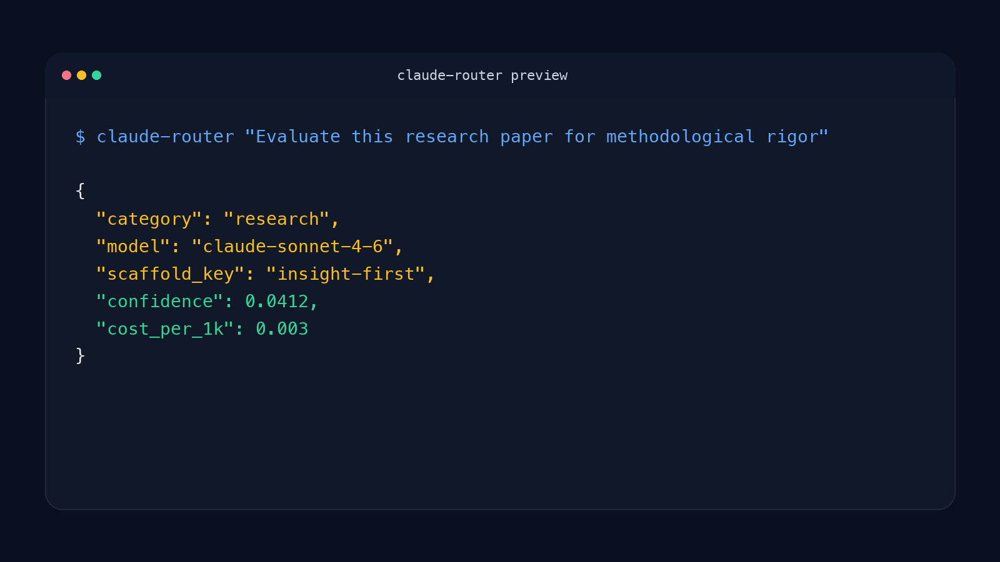

<div align="center">

<h1>claude-router</h1>

claude-router is a local prompt router that picks the right Claude model tier and prepends the right scaffold using local embeddings, before you call the API.

claude-router is developed by [Hermes Labs](https://hermes-labs.ai).

Hermes Labs is an agentic infrastructure company building the reliability layer for autonomous systems.

[](https://github.com/hermes-labs-ai/claude-router/actions/workflows/ci.yml)

</div>

Claude teams overspend on Sonnet or Opus because nobody has a fast, repeatable way to decide when Haiku plus structure is enough. claude-router classifies a prompt locally, chooses the right Claude tier, and prepends the right scaffold when scaffolding actually improves quality.

- "We default to Sonnet for everything because nobody trusts routing by hand."
- "Some prompts need structure, but we keep discovering that too late."
- "We know Haiku is cheaper, but we do not know when it is safe."
- "Prompt reviews catch model-choice mistakes after the API bill already happened."

## Install

Requires: Python 3.10+, `requests`, `numpy`, and [Ollama](https://ollama.com) running locally with nomic-embed-text.

```bash
pip install claude-router
ollama pull nomic-embed-text
```

```python
from claude_router import ClaudeRouter

router = ClaudeRouter()
result = router.route("Evaluate this research paper for methodological rigor")
print(result["model"], result["scaffold_key"])
print(result["pricing"]["input_usd_per_mtok"], result["pricing"]["output_usd_per_mtok"])
```

```text
claude-haiku-4-5 calibrated-scoring
1.0 5.0
```

**When To Use It**

Use `claude-router` when you already call Claude models and want a local, deterministic routing layer for eval, research, content, and review prompts.

**When Not To Use It**

Do not use `claude-router` as a general agent framework, as proof that these exact routes transfer to your workload, or if you do not want an Ollama-based local classifier in the loop.



## Results

| Task | Best Setup | Run cost (2026-03) | Quality vs. Baseline |
|------|-----------|------|------------|
| Eval/scoring | Haiku + scaffold | $0.06 | MAE 1.0 (vs Sonnet raw: 1.2) |
| Research | Sonnet + scaffold | $0.28 | 8.49/10 (vs Opus raw: 7.45) |
| Content | Haiku + scaffold | $0.06 | 4/5 blind wins vs Sonnet |
| Code review | Sonnet (raw) | $0.28 | Sonnet raw preferred; scaffolds hurt coding |

Run costs are what these benchmark batches cost at the list prices in effect on their
2026-03 run dates. They are historical, not a forecast, and not current pricing — see
[Pricing](#pricing).

These runs used the Claude 4.x generation (Haiku 4.5, Sonnet 4.6, Opus 4.6). The router
now returns the current generation for each tier (see [Routing table](#routing-table)),
so the routing table's evidence is one model generation behind the models it returns. It
has not been re-validated on Sonnet 5 or Opus 5 yet; `claude-router --eval` (below) checks
classification, not output quality.

## Anti-findings

These are the blocker issues. The router handles them automatically:

- **Scaffolds break operational tasks** (0/9 success). Haiku treats constraints as meta-instructions instead of executing tasks.
- **Scaffolds hurt coding** (4.9 vs 6.4 raw). Don't scaffold code review, design, or debugging.
- **Opus doesn't scaffold**. Safety-critical evals need Opus raw (MAE 0.0), not scaffolded.

The routing table avoids these entirely: no scaffolds on operational, coding, safety-critical, or conversation tasks.

## Quick start

```python
from claude_router import ClaudeRouter

router = ClaudeRouter()
result = router.route("Evaluate this research paper for methodological rigor")

print(result["model"])           # claude-haiku-4-5
print(result["scaffold_key"])    # calibrated-scoring
print(result["pricing"])         # {'model_id': 'claude-haiku-4-5',
                                 #  'input_usd_per_mtok': 1.0, 'output_usd_per_mtok': 5.0,
                                 #  'input_usd_per_1k': 0.001, 'output_usd_per_1k': 0.005,
                                 #  'basis': 'first_party_uncached_non_batch_global',
                                 #  'as_of': '2026-09-11', 'source': 'https://platform.claude.com/...'}

# Build prompt with scaffold prepended
prompt = router.build_prompt("Evaluate this research paper...")
# → Pass prompt as system message to Anthropic API
```

Or CLI:

```bash
claude-router "Write a blog post about Q2 results"
python -c "from importlib.metadata import version; print(version('claude-router'))"   # prints the installed release (the `--version` flag exists only in source checkouts newer than 1.1.1; on the released wheel it would be routed as a prompt)
```

From a source checkout without installing, `python router.py "..."` runs the same router.

## How it works

1. Embed your prompt using nomic-embed-text (~5ms)
2. Compare against pre-computed task-category centroids
3. Look up routing table: category → model + scaffold
4. Return model ID and scaffold text

No LLM calls for routing. All locally in ~10ms. When the classifier is not confident in a category, the router defaults to Opus.

## The 5 scaffolds

Each scaffold is validated through blind evaluation. They work by constraining the model's output space to the task structure.

See [scaffolds.json](scaffolds.json) for full text and evidence:

- **calibrated-scoring**: Integer 1-10, cite evidence, not generous/critical
- **insight-first**: Lead non-obvious, concrete recs, 3-4 sentences
- **plan-first**: g:goal;c:constraints;s:steps;r:risks prefix
- **substance-check**: Real gaps not surface, name issue and location
- **bug-hunt**: Specific bugs, line numbers, severity, one-line fix

## Routing table

```
eval              → Haiku   + calibrated-scoring
research          → Sonnet  + insight-first
content           → Haiku   + insight-first
analytical_review → Haiku   + substance-check
search            → Haiku   + plan-first

coding_review     → Sonnet  (raw)
coding_design     → Sonnet  (raw)
coding_debug      → Sonnet  (raw)
operational       → Sonnet  (raw)
status_check      → Haiku   (raw)
conversation      → Opus    (raw)
safety_critical   → Opus    (raw)
```

Low confidence → Opus (safe default).

Tiers resolve to current-generation model IDs: Haiku → `claude-haiku-4-5`,
Sonnet → `claude-sonnet-5`, Opus → `claude-opus-5`. A fourth tier, `fable` →
`claude-fable-5-1`, is priced and accepted in custom routing tables, but no default
category routes there: it costs 2x Opus and none of the bundled evidence covers it.

## Evaluating the routing table

`claude-router --eval [cases.json]` routes a labelled prompt set and reports how often the
classifier lands on the expected category and tier, which prompts it misrouted, and what
the routed tiers cost against sending every prompt to Sonnet:

```bash
claude-router --eval                      # shipped set: 24 prompts, 2 per category
claude-router --eval my_cases.json        # {"cases": [{"prompt": ..., "category": ...}]}
```

```python
from claude_router.evaluate import evaluate, load_cases

report = evaluate(ClaudeRouter(), load_cases(), tokens_in=1000, tokens_out=1000)
report["category_accuracy"], report["tier_accuracy"], report["misroutes"]
report["cost"]["routed_over_baseline"]   # routed list price / all-Sonnet list price
```

The cost figure is a list-price estimate at the stated tokens per call, not a measurement.
The shipped labels are the intended routes, not benchmark ground truth: a miss means the
classifier and the label disagree, and either may be wrong. Routing still needs Ollama;
only the scoring is offline.

## Pricing

`route()` returns the routed model's exact list prices, with the date and source they
were read from, so you can do the arithmetic on your own token volumes:

| Tier | Model ID | Input $/MTok | Output $/MTok |
|------|----------|-------------:|--------------:|
| Haiku | `claude-haiku-4-5` | $1.00 | $5.00 |
| Sonnet | `claude-sonnet-5` | $2.00 | $10.00 |
| Opus | `claude-opus-5` | $5.00 | $25.00 |
| Fable | `claude-fable-5-1` | $10.00 | $50.00 |

Base (uncached, non-batch, global-inference) first-party Claude API prices as of
**2026-09-11**, from [platform.claude.com/docs/en/about-claude/pricing](https://platform.claude.com/docs/en/about-claude/pricing).
Prompt caching, the Batch API, and `inference_geo` all apply multipliers this table does
not model. The single maintained copy is [`src/claude_router/model_pricing.json`](src/claude_router/model_pricing.json),
read by both the packaged router and `router.py`.

This repo publishes no cost-savings total. What routing saves depends on your prompt mix
and, critically, on your input:output token ratio — output costs 5x input on every tier
above, so a savings figure computed from input price alone is wrong. Multiply your own
measured token counts by the two columns above.

`result["cost_per_1k"]` is still returned for existing consumers. It is **deprecated and
input-only** (`result["cost_per_1k_basis"] == "input_tokens_only"`): it is the input price
per 1K tokens and has never included output tokens. Use `result["pricing"]` for anything
that needs to be right.

## Customization

Swap scaffolds, centroids, or routing table:

```python
router = ClaudeRouter(
    centroids_path="my_centroids.json",
    routing_table_path="my_routing.json",
    scaffolds_path="my_scaffolds.json"
)
```

## Limitations

- Requires Ollama locally (for embeddings)
- Centroids trained on one task distribution — test on your workload
- The classifier is not perfect — ambiguous prompts fall to low confidence and default to Opus
- Anti-findings are real: scaffolds on coding/operational make things worse
- The routing table was validated on the 4.x generation; it now returns Sonnet 5 and
  Opus 5 without a fresh quality benchmark on them
- Prices are a dated snapshot, not a live feed — re-check `model_pricing.json` against the
  published source before relying on it for billing
- No Lite mode (Haiku-first routing): still not available in the current release, 1.1.1 —
  see the [v1.1.1 release notes](https://github.com/hermes-labs-ai/claude-router/releases/tag/v1.1.1)
  (also in [CHANGELOG.md](CHANGELOG.md))

## Evidence

Benchmarks: [benchmarks/](benchmarks/) | Raw citations: [scaffolds.json](scaffolds.json) | License: [MIT](LICENSE)

Key experiments: 4-condition code/research crossover, scaffolds-vs-operational stress test, scaffolded Sonnet beats Opus 75% on research (6/8 blind wins, 140 API calls).

Need this calibrated to your pipeline? [Open an issue](https://github.com/hermes-labs-ai/claude-router/issues) with the task categories and failure cases you want to benchmark.

---

## More from Hermes Labs

Browse the [open-source catalog](https://hermes-labs.ai/open-source) or contact [roli@hermes-labs.ai](mailto:roli@hermes-labs.ai).

- [lintlang](https://github.com/hermes-labs-ai/lintlang) — Static analysis for AI agent tool descriptions and workflows.
- [little-canary](https://github.com/hermes-labs-ai/little-canary) — Prompt injection detection through a powerless sacrificial model.
- [fidelis](https://github.com/hermes-labs-ai/fidelis) — Semantic memory for long-running agents with local retrieval.
- [hermeneutic](https://github.com/hermes-labs-ai/hermeneutic) — Detect recurring AI drift from correction history.
- [zer0dex](https://github.com/hermes-labs-ai/zer0dex) — Local agent recall without burdening the context window.
- [claude-plugins marketplace](https://github.com/hermes-labs-ai/claude-plugins) — Plugin system for Claude Code extensibility.
